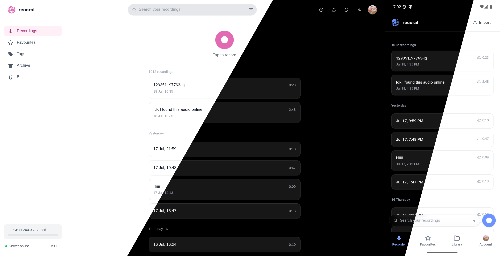
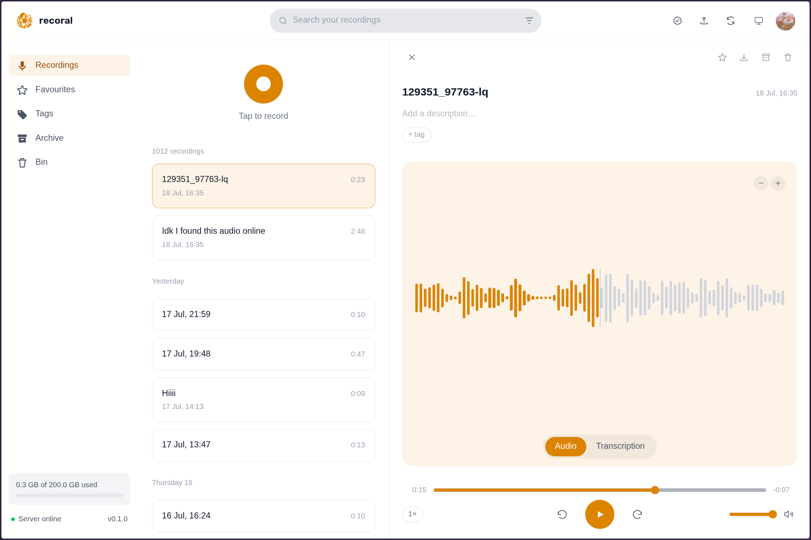
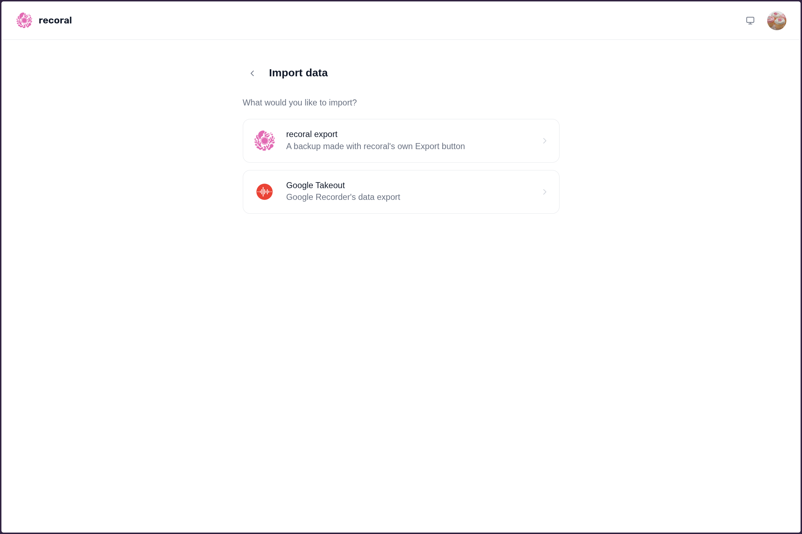
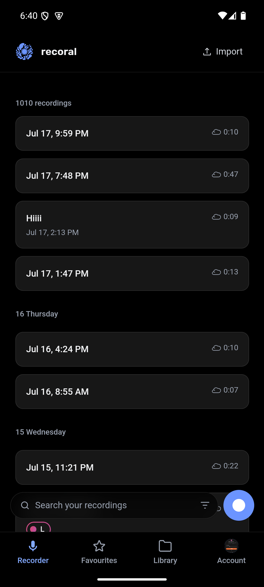
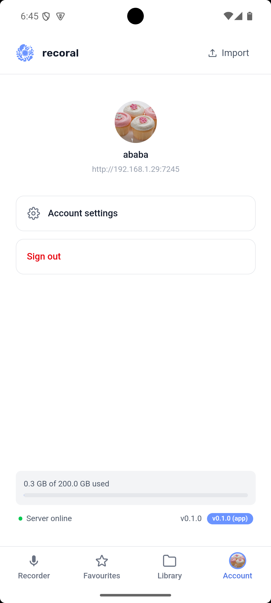
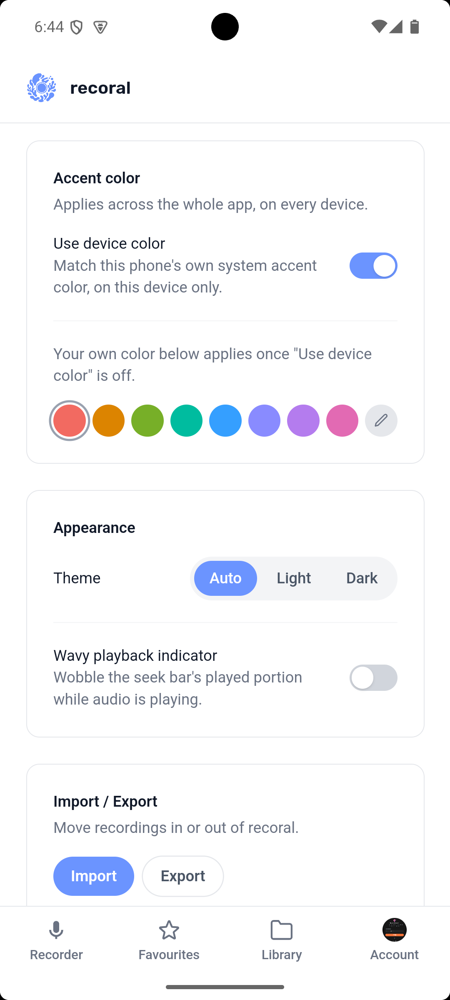
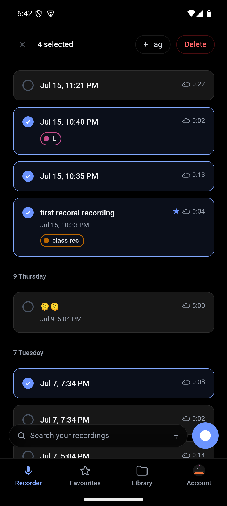
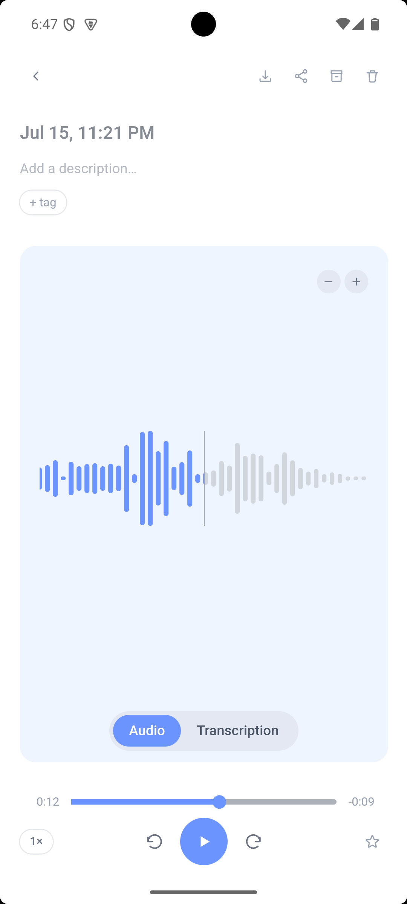
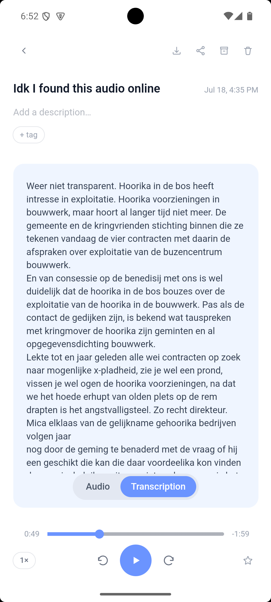

Self-hostable voice recorder, a free and open Google Recorder alternative, the vision was pretty much [Immich](https://github.com/immich-app/immich)'s architecture but for audio instead of photos.

<p align="center">
  
</p>

## What it does

- Record audio from your phone, pwa or browser
- Automatic server-side transcription, with gpu acceleration possible
- Material You theme, per-user accent color, full light/dark support, and android accent color
- Self-hosted: your server, your data
- Tags with subtag hierarchy, favorites, archive, bin
- Google Takeout import, so your existing Google Recorder history carries over

## Screenshots

<details>
<summary>Desktop</summary>
<br>




</details>

<details>
<summary>Mobile</summary>
<br>

<table>
<tr>
<td></td>
<td></td>
<td></td>
</tr>
<tr>
<td></td>
<td></td>
<td></td>
</tr>
</table>

</details>

## Quick start

```bash
mkdir recoral && cd recoral # you want to go into the directory where you want to install recoral
curl -o docker-compose.yml https://raw.githubusercontent.com/luniiya/recoral/main/docker-compose.release.yml
curl -o .env https://raw.githubusercontent.com/luniiya/recoral/main/.env.example
docker compose up -d
```

Then open `http://<your-server-ip-or-domain>:7245` (or whatever port you set in `.env`).

### Updating

```bash
docker compose pull
docker compose up -d
```

Pulls whatever `RECORAL_VERSION` is set to in `.env` (`latest` by default) and
recreates the containers with it. Your recordings and models live in a plain
`./data` folder next to `docker-compose.yml` (not inside the containers
themselves), so this doesn't touch your data. Pin `RECORAL_VERSION` to a
specific release tag in `.env` instead of `latest` if you'd rather upgrade
deliberately than automatically track new releases.

Transcription runs CPU-only by default. If you have a compatible AMD GPU
(ROCm, gfx1100/gfx1101 tested), see the comments in `docker-compose.yml` for
the GPU-accelerated variant.

Android APK builds are attached to each [GitHub release](https://github.com/luniiya/recoral/releases). iOS isn't built yet.
